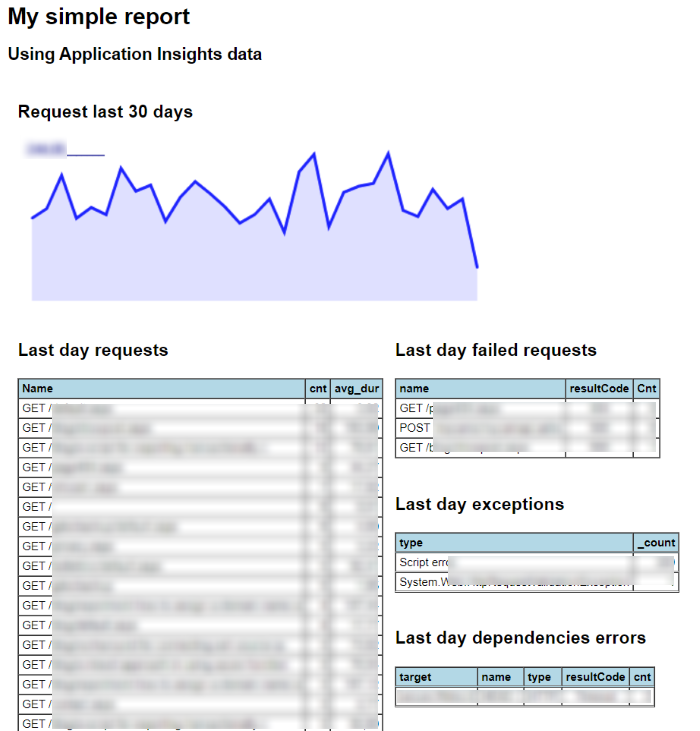

## Simple report using data from Application Insights

The tool builds a html report starting from a html template containing Kusto Application Insights queries.
The queries output is tranformed into html tables and png images and inserted into the final html.
The resulting html can be saved locally or easily sent by email after embedding images as "CID:".

**Note**: the HTML template must be a valid XML because it is processed using XmlDocument.
   
Template fragment tranformed into a html table:

```html
...
<table border="1" cellspacing="0" cellpadding="3" style="font-size:12px;">
    <AppInsightData>
        <Query>
            exceptions
            | where timestamp > ago(1d)
            | summarize _count=sum(itemCount) by type
            | sort by _count desc
        </Query>
        <Align>l#r</Align>
        <OutMode>TR</OutMode>
        <THeadStyle>background-color:lightblue;font-weight:bold;</THeadStyle>
    </AppInsightData>
</table>
...
```

Resulting output:

<table border="1" cellspacing="0" cellpadding="3" style="font-size:12px;">
  <thead style="background-color:lightblue;font-weight:bold;">
    <tr>
      <td align="left">type</td>
      <td align="right">_count</td>
    </tr>
  </thead>
  <tbody>
    <tr><td align="left">Script error.</td><td align="right">3</td></tr>
    <tr><td align="left">System.Web.HttpRequestValidationException</td><td align="right">7</td></tr>
  </tbody>
</table>

```html
<table border="1" cellspacing="0" cellpadding="3" style="font-size:12px;">
  <thead style="background-color:lightblue;font-weight:bold;">
    <tr>
      <td align="left">type</td>
      <td align="right">_count</td>
    </tr>
  </thead>
  <tbody>
    <tr><td align="left">Script error.</td><td align="right">3</td></tr>
    <tr><td align="left">System.Web.HttpRequestValidationException</td><td align="right">7</td></tr>
  </tbody>
</table>
```

Template fragment tranformed into a png:

```html
<AppInsightData>
    <Query>
        requests
        | where timestamp > ago(30d)
        | summarize cnt=sum(itemCount) by bin(timestamp, 1d)
        | order by timestamp asc
        | project timestamp, cnt
    </Query>
    <OutMode>IMG</OutMode>
    <ImgWidth>500</ImgWidth>
    <ImgHeight>200</ImgHeight>
    <ImgColor>#0000FF</ImgColor>
    <ImgFileName>1.png</ImgFileName>
</AppInsightData>
```

Output:

``` html
  
```


## Application ID and Key 
You need Application ID and Key values for accessing Application Insights API (Azure Portal --> application insights --> API access)  


The values can be stored directly inside the html template or somewhere else and pass them explicitelly to the ReportBuilder.
In the former case, remmber to protect the template file because of sensitive data it contains. 
However that sensitive data will be removed from the output, resulting in a plain standard html.

Storing inside html template:
```html
...
<AppInsightsConfig>
   <AppID>abc.......</AppID>
   <ApiKey>xyz.....</ApiKey>
</AppInsightsConfig>
...
```


<br/>
<br/>

## Output example



